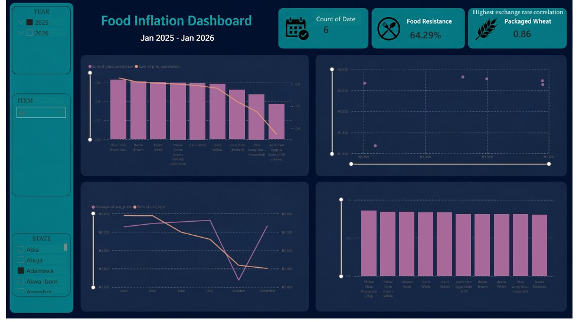
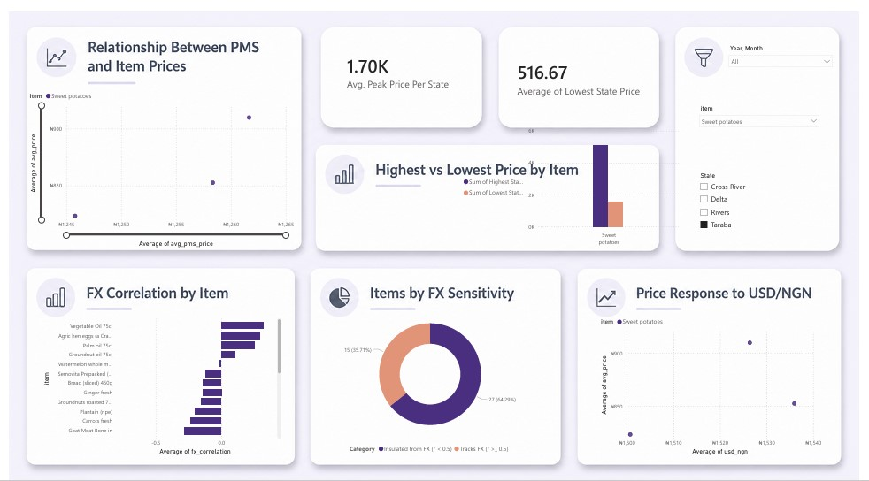

# 🇳🇬 Nigerian Food Price Intelligence: Exchange Rate & Food Inflation Analysis #

## Project Overview ##
This project investigates the relationship between food prices in Nigeria and major macroeconomic indicators, particularly the USD/NGN exchange rate and Premium Motor Spirit (PMS) prices.
The goal was to determine whether fluctuations in foreign exchange rates correspond to increases in food prices across Nigeria and whether transportation costs (represented by PMS prices) have a measurable influence on selected food commodities.
The analysis uses official monthly food price reports published by the National Bureau of Statistics (NBS) et al., covering all 36 states.
The final output is an interactive Power BI dashboard designed to help users explore food inflation trends, compare regional prices, and understand how macroeconomic indicators relate to changes in food prices over time.

## Motivation ##
Many studies investigate inflation using consumer price indices, but fewer explore the behaviour of individual food commodities.
Initially, the project was intended to collect live market prices through web scraping. However, because reliable nationwide food price data is not consistently available online—and waiting months to accumulate enough observations was impractical—the project instead used official NBS datasets, providing standardized nationwide monthly observations.


## Objectives ##
- Analyse monthly food price trends across Nigeria.
- Measure correlation between food prices and USD/NGN exchange rates.
- Explore whether PMS prices explain variation in selected food prices.
- Identify commodities most sensitive to macroeconomic changes.
- Compare state-level price differences.
- Identify states with the highest and lowest prices for selected foods.
- Present findings through an interactive Power BI dashboard.

## Dataset ##

### Coverage ###

- Nigeria
- 13 months; January 2025 - January 2026
- All 36 states
- Multiple food commodities
- Monthly observations
- Data Cleaning

The raw NBS reports required extensive preprocessing.

Cleaning steps included:

- Extracting Excel files from compressed archives.
- Standardising inconsistent column names.
- Removing repeated header rows.
- Handling missing values.
- Cleaning inconsistent food naming conventions.
- Converting prices to numeric values.
- Combining monthly reports into a single analytical dataset.
- Reshaping data into a format suitable for analysis.

### Analysis Performed ###
- Exploratory Data Analysis (EDA)
- Time-series trend analysis
- Correlation analysis
- State-by-state price comparisons
- Highest and lowest price identification
- Exchange rate vs food price analysis
- PMS vs food price analysis
  

# Dashboard Preview

## Page 1 – Executive Overview



Provides a high-level summary of food inflation trends, exchange rate movements, PMS prices, regional comparisons, and key performance indicators.

---

## Page 2 – Item Deep Dive



Allows users to explore individual food commodities, compare price trends over time, and examine their relationship with exchange rate and PMS movements.

---

# Methodology

## Data Preparation

Because each dataset differed in structure and reporting frequency, several preprocessing steps were required.

These included:

- Consolidating monthly NBS reports into a single dataset
- Cleaning inconsistent commodity names
- Removing duplicate and invalid records
- Handling missing values
- Standardizing date formats
- Aggregating daily exchange rate data into monthly averages to align with the monthly food price reports
- Transforming datasets into an analysis-ready format

---

## Data Storage

The processed datasets were loaded into PostgreSQL to create a centralized database for analysis and querying.

---

## Exploratory Data Analysis

Python was used to explore relationships within the data before dashboard development.

The analysis included:

- Commodity price trends
- Exchange rate sensitivity
- PMS price sensitivity
- Correlation analysis
- Regional price comparisons
- Highest and lowest state-level prices

---

## Dashboard Development

Power BI was used to build an interactive dashboard that enables users to:

- Explore food price trends over time
- Compare prices across Nigerian states
- Analyze exchange rate movements alongside food prices
- Examine PMS price trends
- Filter by commodity and reporting period
- Investigate relationships between macroeconomic indicators and food prices

---

## Key Findings ##

- Prepacked wheat flour exhibited the strongest positive correlation with the USD/NGN exchange rate, followed by white garri, yellow garri, rice, beans, and a crate of eggs (30 pieces).
- Several staple foods increased in price alongside exchange rate depreciation, suggesting that exchange rate movements may influence food prices through import costs, production inputs, or broader inflationary pressures.
- Premium Motor Spirit (PMS) prices explained part of the variation in transportation-dependent foods. However, some commodities that were expected to have a strong positive relationship with PMS—particularly those showing weaker or negative relationships with the exchange rate—did not exhibit strong correlations with PMS prices.
- This suggests that transportation costs alone do not fully explain food price movements and that other domestic factors, such as seasonality, local supply conditions, production costs, and regional market dynamics, likely play important roles.
- Significant price differences were observed across Nigerian states, highlighting regional disparities in food markets.


---

# Data Sources

| Dataset | Source |
|---------|--------|
| Monthly Food Prices | National Bureau of Statistics (NBS) |
| USD/NGN Exchange Rate | Central Bank of Nigera (CBN) |
| Premium Motor Spirit (PMS) Prices | National Bureau of Statistics (NBS) |

---

# Tools & Technologies

- **Python**
- **Pandas**
- **NumPy**
- **Matplotlib**
- **PostgreSQL**
- **Power BI**
- **Jupyter Notebook**

---

# Repository Structure

```
nigeria-food-price-intelligence/
│
├── dashboard/
│
├── images/
│
├── notebooks/
│
├── figures/
│
├── README.md
└── requirements.txt
```
# Future Improvements

### Potential extensions for this project include: ###

* Incorporating Consumer Price Index (CPI) data.
* Expanding the analysis to cover additional years.
* Developing predictive models for food price forecasting.
* Introducing automated data pipelines for monthly updates.
* Publishing the dashboard through the Power BI Service for real-time access.

## Author ##

Denise Moemeke
Data Scientist | Aspiring Data Engineer
